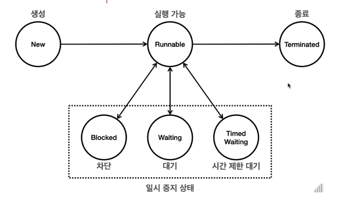

# PACKAGE DESCRIPTION

# NOTE
## 0. 개념
### 멀티태스킹과 멀티프로세싱

- 멀티 프로세싱 : 컴퓨터 시스템에서 둘 이상의 프로세서를 사용하여 여러 작업을 동시에 처리하는 기술
- 멀티 태스킹 : 단일 CPU가 여러 작업을 동시에 수행하는 것처럼 보이게 하는 것.
- 멀티 프로세싱은 하드웨어 장비의 관점이고, 멀티 태스킹은 운영체제의 관점이다.

### 프로세스와 스레드

- 프로세스는 실행 환경과 자원을 제공하는 컨테이너 역할을 하고, 스레드는 CPU를 사용해서 코드를 하나하나 실행한다.

- 프로세스
    - 운영체제 안에서 실행중인 프로그램
    - 독립적인 공간을 가지며 운영체제에서 별도의 작업 단위로 분리해서 관리된다. == 서로 간섭하지 않는다.
    -  메모리 구성
    - 코드 섹션 : 실행할 프로그램의 코드가 저장되는 부분
    - 데이터 섹션 : 전역 변수 및 정적 변수가 저장되는 부분
    - 힙 : 동적으로 할당되는 메모리 영역
    - 스택 : 메서드 호출 시 생성되는 지역 변수와 반환 주소가 저장되는 영역 (스레드에 포함)
- 스레드
    - 프로세스는 하나 이상의 스레드를 포함한다 ==. 프로세스 내에서 실행되는 작업의 단위.
    - 프로세스가 제공하는 동일한 메모리 공간을 공유한다.
    - 메모리 구성
        - 공유 메모리 : 같은 프로세스의 코드 섹션, 데이터 섹션, 힙(메모리)는 프로세스 안의 모든 스레드가 공유한다.
        - 개별 스택 : 각 스레드는 자신의 스택을 갖고 있다.
- 멀티 스레드가 필요한 이유
    - 하나의 프로그램도 그 안에서 동시에 여러 작업이 필요
    - 워드 프로그램 (프로세스A)
        - 스레드 1: 문서편집
        - 스레드 2 : 자동저장
        - 스레드 3 : 맞춤법 검사

### 스레드와 스케줄링
- 스케줄링 : CPU에 어떤 프로그램이 얼마만큼 실행될지 운영체제가 결정하는 것
- 운영체제가 스레드를 어떻게 스케줄링 하는가. 스케줄링 관점에서 살펴본다.
- 단일 코어 스케줄링
    - 운영체제는 내부에 스케줄링 큐를 가지고, 각각의 스레드는 스케줄링 큐에서 대기한다.
    - 스케줄에 맞게 CPU 코어에 스레드를 할당하여 실행시킨다.
- 멀티 코어 스케줄링
    - 위와 같으나 CPU 코어가 2개 이상으로 이루어져 있다.

### 컨텍스트 스위칭
- 멀티태스킹이 반드시 효율적인 것 만은 아니다. (흐름이 끊기잖소ㅠ-ㅠ)
- 이전에 실행 중인 값을 메모리에 잠깐 저장하고, 이후에 다시 실행하는 시점에 저장한 값을 CPU에 다시 불러오는 과정을 컨텍스트 스위칭이라고 한다.
- 멀티스레드는 대부분 효율적이지만, 컨텍스트 스위칭 과정이 필요하므로 항상 효율적인 것은 아니다.


## 1. 스레드 생성과 실행
- 스레드 간 실행 순서와 실행 기간을 보장하지 않는다.
### start()와 run()의 차이
- 별도의 스레드 객체를 생성 해 start() 메서드를 실행 시키면 별도의 스레드가 만들어지며 실행된다.
- 하지만 run() 메서드를 직접 실행 시키면 별도의 스레드가 run()을 실행하는 것이 아니라, run()을 호출한 스레드에서 run()을 실행한다.
- 스레드를 start()로 호출해줘야 비로소 스레드가 된다..(별)
```java
public class HelloThread extends Thread{
    @Override
    public void run() {
        System.out.println(Thread.currentThread().getName() + ": run()");
        ByeThread byeThread = new ByeThread();
        byeThread.setName("byeThread");
        byeThread.run();
    }
}

public class ByeThread extends Thread{
    @Override
    public void run() {
        System.out.println(ByeThread.currentThread().getName() + ": I'm byeThread's run");
    }
}

public class Main {
    public static void main(String[] args) {
        HelloThread helloThread = new HelloThread();
        helloThread.setName("hellothread");
        helloThread.start();
    }
}
```
```
hellothread: run()
hellothread: I'm byeThread's run
```

### 데몬 스레드
- 사용자 스레드
    - 프로그램의 주요 작업 실행
    - 작업이 완료될 때까지 실행된다.
    - 모든 user스레드가 종료되면 JVM도 종료된다.
- 데몬 스레드
    - 백그라운드레서 보조적 작업
    - 모든 user 스레드가 종료되면 데몬 스레드는 자동으로 종료된다.
- JVM은 데몬 스레드의 실행 완료를 기다리지 않고 종료된다. 데몬 스레드가 아닌 모든 스레드가 종료되면, 자바 프로그램도 종료된다.

### Runnable 을 구현해서 Thread 생성
- Thread 생성 시, Runnable을 구현한 클래스를 생성자에 넣어 생성한다.
- 스레드를 사용할 때는 Thread를 상속받는 방법보다 Runnable 인터페이스를 구현하는 방식을 사용한다.
  - 자바는 단일 상속만 허용하므로, Thread를 상속하는 경우 다른 클래스를 상속할 수 없다.
  - 인터페이스를 사용하는 방법에 비해 유연성이 떨어진다.
  - 인터페이스 이용 시, 코드의 분리가 되어 쓸데 없는 Thread 관련 메서드나 필드를 사용하지 않는다.
- Runnable을 만드는 다양한 방법
```java
/**
 * 내부클래스
 */
import static util.MyLogger.log;

public class InnerRunnableMain1 {
    public static void main(String[] args) {
        log("main() start");
        MyRunnable myRunnable = new MyRunnable();
        Thread thread = new Thread(myRunnable);
        thread.start();
        log("main() end");

    }
    static class MyRunnable implements Runnable {
        @Override
        public void run() {
            log("run()");
        }
    }
}

/**
 * 익명 클래스 
 */
public class InnerRunnableMain3 {
  public static void main(String[] args) {
    log("main() start");
    Thread thread = new Thread(new Runnable() {
      @Override
      public void run() {
        log("run()");
      }
    });
    thread.start();
    log("main() end");

  }
}

/**
 * 람다식
 */
public class InnerRunnableMain4 {
  public static void main(String[] args) {
    log("main() start");
    Thread thread = new Thread(() -> log("run()"));
    thread.start();
    log("main() end");

  }
}
```

## 2. 스레드 제어와 생명 주기
### Thread 클래스
- Thread 클래스는 스레드를 생성하고 관리하는 기능을 제공한다.
```
Thread myThread = new Thread(new HelloThread(), "myThread");
myThread : Thread[#23,myThread,5,main]
myThread.threadId() : 23
myThread.getName() : myThread
myThread.getPriority() : 5
myThread.getThreadGroup() : java.lang.ThreadGroup[name=main,maxpri=10]
myThread.getState() : NEW
```
### 스레드 생명주기
- `NEW` : 스레드가 아직 시작되지 않은 상태
- `RUNNABLE` : 스레드가 실행 중이거나 실행될 준비가 된 상태
- `BLOCKED`  : 스레드가 동기화 락을 기다리는 상태
- `WAITING` : 스레드가 다른 스레드의 특정 작업이 완료되기를 기다리는 상태
- `TIMED_WAITING` : 일정 시간 동안 기다리는 상태 (`Thread.sleep()`)
- `TERMINATED` : 스레드가 실행을 마친 상태


### runnable run() 체크 예외 재정의 
- 자바에서 메서드를 재정의 할 때, 재정의 메서드가 지켜야할 예외와 관련된 규칙이 있다.
  - 부모 메서드가 체크 예외를 던지지 않는 경우, 재정의된 자식 메서드도 체크 예외를 던질 수 없다. => 컴파일 오류
  - 자식 메서드는 부모 메서드가 던질 수 있는 체크 예외의 하위 타입만 던질 수 있다.
  - 언체크(런타임) 예외는 처리를 강제하지 않으므로 상관 없이 던질 수 있다.
- 왜 이런 제약이 있을까?
  - 예외 처리를 일관성을 해치고 런타임 오류를 초래할 수 있다. 
- Runnable 인터페이스의 run()은 아무런 체크 예외를 던지지 않는다. 
  - 예외 처리를 강제함으로써 스레드의 안정성과 일관성을 유지 

### JOIN
- 📁src/thread/control/join
  - V0 : 메인 스레드와 스레드 진행
  - V1 : 메인 스레드가 먼저 끝나 의도치 않은 값 반환됨
  - V2 : sleep()를 통해 작업 스레드가 작업이 다 끝난 뒤에 main 스레드에서 값을 반환하도록 함. 정확한 시간을 맞추기 어려움 
  - V3 : join() 사용. 무기한 기다려야 하는 상황을 방지 하고 싶을 땐 어떡할까.
- join(), join(ms)
  - 전자는 호출하는 스레드는 대상 스레드가 종료될 때 까지 기다려야 하며, 후자는 기다리되 특정 시간동안까지만 기다린다.
  - 전자는 기다리는 동안 호출하는 스레드는 WAITING 상태가 되고, 후자는 TIMED_WAITING 상태가 된다. 

## 기타
### this의 비밀
- 어떤 메서드를 호출 == 특정 스레드가 어떤 메서드를 호출하는 것
- 스레드는 메서드 호출을 관리하기 위해 메서드 단위로 스택 프레임을 만들고 해당 스택 프레임을 스택 위에 쌓아 올린다.
- 이때 인스턴스의 메서드를 호출하면, 어떤 인스턴스의 메서드를 호출했는지 기억하기 위해, 해당 인스턴스의 참조값을 스택 프레임 내부에 저장한다.
- this는 이 참조값을 가리킨다.